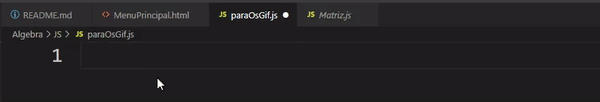
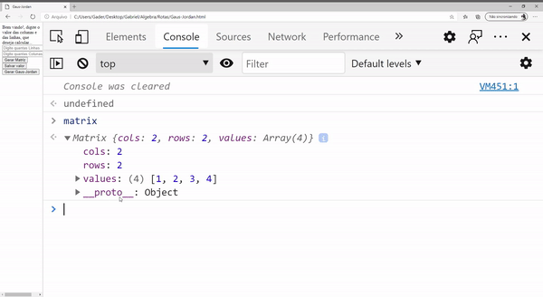
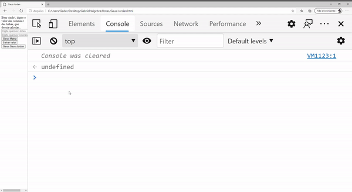
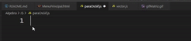
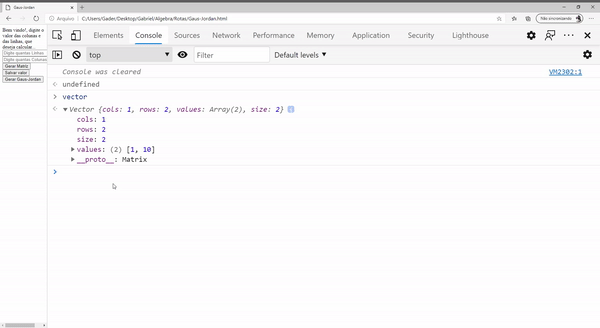
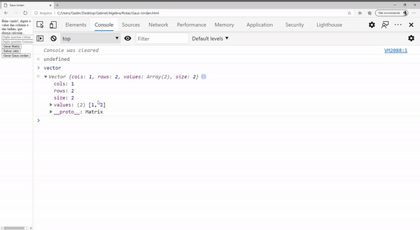

# Bliblioteca de Algebra Linear

## Olá, seja bem vindo, este repositorio se refere a todos os trabalhos, de minha cadeira da faculdade de algebra linear: 
 Onde a ideia consite em ser uma biblioteca que contenha a maioria das ferramentas para Algebra Linear básica em javascript.
No repositorio contem uma Pagina demo, para demostrar as funcionalidades.

* <a href="#matrix">Classe Matrix - Como usar</a> 
* <a href="#vector">Classe Vector - Como usar</a>  
* <a href="#LinearAlgebra">Classe Linear Algebra - Como usar</a> 
* <a href="#tranformation">Classe Transformations - Como usar</a> ,
* <a href="#autor">Autor</a>

<h1>Classe matrix</h1>

 
    Essa é a classe mais básica para poder usar a biblioteca, todas as operações que forem realizar terão que ultilizar um objeto dessa classe. 

    A classe matrix, contem 3 contrutores: Rows(Linhas),Cols(Colunas),Values(Valores da matrix): Onde, irá criar o objeto, para ele poder ser manipulado depois:
    <h1>EXEMPLO: </h1>
    

    <h1>Metodos da classe:</h1>
    Essa classe contem três metodos nela: get,set e getIndex: 
    <ul>
        <li><a href="#get">Get</a></li>
        <li><a href="#set">Set</a></li>
        <li><a href="#getIndex">GetIndex</a></li>
    </ul>

<h1>GET</h1>
 O metodo get é para pegar uma informção de dentro da classe. Basicamente utilizamos ela para pegar um valor especifico que queremos
 OBS: o valor na matriz começa no 1
 <h1>EXEMPLO: </h1>
    

<h1>SET</h1>
 O metodo set é para jogar uma informção de dentro da classe. Basicamente utilizamos ela para jogar um valor especifico que queremos
 OBS: o valor na matriz começa no 1
 <h1>EXEMPLO: </h1>
    

<h1>GET-INDEX</h1>
 O metodo getIndex é para pegar a informação especifica de onde estaria a posição especifica no vetor. Basicamente utilizamos ela para pegar um valor especifico que fica no vetor(Basicamente seria o mesmo que get - 1)
 <h1>EXEMPLO: </h1>
    

<h1>Classe Vetor</h1>

 
    Uma extenção da classe matrix, onde é basicamente um vetor(Tipo de estrutura de dados), que vai ser importante para especificações na hora de transições Lineares. 

    A classe Vector, contem 2 contrutores:Dim(),Values(Valores da matrix): Onde irá criar o objeto para ele poder ser manipulado depois:
    <h1>EXEMPLO: </h1>
    

    <h1>Metodos da classe:</h1>
    Essa classe contem dois metodos nela: get e set: 
    <ul>
        <li><a href="#get">Get</a></li>
        <li><a href="#set">Set</a></li>
    </ul>

<h1>GET</h1>
 O metodo get é para pegar uma informção de dentro da classe. Basicamente utilizamos ela para pegar um valor especifico que queremos
 OBS: o valor no vetor começa no 1
 <h1>EXEMPLO: </h1>
    

<h1>SET</h1>
 O metodo set é para jogar uma informção de dentro da classe. Basicamente utilizamos ela para jogar um valor especifico que queremos
 OBS: o valor no vetor começa no 1
 <h1>EXEMPLO: </h1>
    

